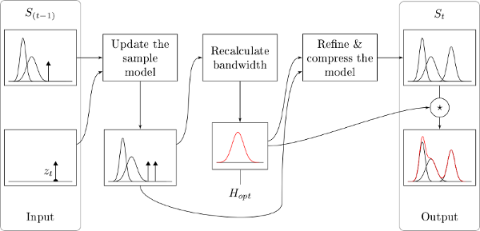

oKDE-Java
=========

This is a Java implementation of the oKDE algorithm proposed by Matej Kristan, 
see ([oKDE](http://www.vicos.si/Research/Multivariate_Online_Kernel_Density_Estimation)).
This project is part of my master's thesis that uses the oKDE algorithm to estimate
a model of human mobility and exploits the estimated model to predict future locations
of human individuals (*Location Prediction Based on Mobility Patterns in Location Histories*:
[git repository](https://github.com/joluet/prepos)).

-------------------------------

1. [oKDE algorithm](#okde)
2. [Build instructions](#build)
3. [Quickstart](#start)

*******************************

<a name="okde">
## oKDE algorithm

Given a set of n-dimensional samples, this algorithm estimates 
the distribution of the samples using kernel density estimation.
The output model is a *Mixture of Gaussians*.
Moreover, the model is compressed and can be updated as new samples arrive.

The basic principle of the oKDE algorithm is summarized by this graphic:

For more details see ([oKDE](http://www.vicos.si/Research/Multivariate_Online_Kernel_Density_Estimation)).

<a name="build">
## Build instructions

Just execute ant in project root to compile the project:

**$ ant**

Afterwards, the packed jar file can be found in the *dist*-folder.

To compile the simple example, run ant with target *example* in project root:

**$ ant example**

<a name="start">
## Quickstart

The file *src/de/tuhh/luethke/Example.java* contains a simple example that uses oKDE-Java
to estimate a distribution of randomly generated samples. This example illustrates the basic usage
of oKDE-java.

To use oKDE-Java in another project just include the jar file (see above [how to build](#build)).
